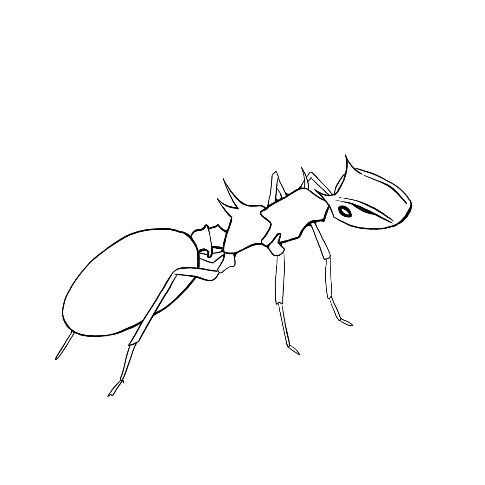

```{r setup, include=FALSE}
knitr::opts_chunk$set(echo = FALSE, warning = FALSE, message = FALSE)
library(vitae)
library(tidyverse)
library(pander)
library(googlesheets4)
library(glue)
library(yaml)
library(knitr)

# Define a custom function for printing nice lists for the publication and talks sections:
catList <- function(x, out.format = knitr::opts_knit$get("out.format"),
                      environment = "itemize",
                      marker = NULL) {
  if (out.format == "markdown") {
    if (!missing(environment) || !missing(marker)) {
      warning("Ignoring arguments that are not supported for markdown output.")
    }
    out <- sprintf("\n\n%s\n \n", paste("*", x, collapse = "\n"))
  } else {
    if (out.format == "latex") {
      itemCommand <- if (missing(marker)) {
        "\\item"
      } else {
          sprintf("\\item[%s]", marker)
      }
      listEnv <- c(
        sprintf("\\begin{%s}\n", environment),
        sprintf("\n\\end{%s}\n", environment))
      out <- paste(itemCommand, x, collapse = "\n")
      out <- sprintf("%s%s%s", listEnv[1], out, listEnv[2])
    } else {
      stop("Output format not supported.")
    }
  }
    return(knitr::asis_output(out))
}

# Read in data:
CVData <- read_sheet("https://docs.google.com/spreadsheets/d/1EF4cO7h3tsKhbuJta43pKPsULGgUzWdK806L1hkwF-8/edit?usp=sharing")

# Process data into sub-tibbles:
Education <- dplyr::filter(CVData, Category == "Education")
Research <- dplyr::filter(CVData, Category == "Research Experience")
Teaching <- dplyr::filter(CVData, Category == "Teaching")
Awards <- dplyr::filter(CVData, Category == "Awards")
Service <- dplyr::filter(CVData, Category == "Service")
Outreach <- dplyr::filter(CVData, Category == "Outreach")
Publications <- dplyr::filter(CVData, Category == "Publications")
Talks <- dplyr::filter(CVData, Category == "Talks")

```

# Education 
```{r}
detailed_entries(Education, 
                 when = glue("{Start}--{End}"),
                 what = Supervisor,
                 where = Institution,
                 with = Position,
                 why = Details)
```

# Research 
```{r}
detailed_entries(Research, 
                 when = glue("{Start}--{End}"),
                 what = Supervisor,
                 where = Institution,
                 with = Position,
                 why = Details)
```


# Teaching 
```{r}
detailed_entries(Teaching, 
                 when = glue("{Start}--{End}"),
                 what = Supervisor,
                 where = Institution,
                 with = Position,
                 why = Details)
```
# Publications
**Published:**
\scriptsize
```{r}
Publications %>%
filter(Type == "Published") %>%
pull("Details") %>%
catList()

```
\normalsize
**In press:**
\scriptsize
```{r}
#Publications %>%
#filter(Type != "Published") %>%
#pull("Details") %>%
#catList()
```
\normalsize
# Talks
**Oral Presentations:**
\scriptsize
```{r}
Talks %>%
filter(Type == "Oral") %>%
pull("Details") %>%
catList()
```
\normalsize
**Lightning talks:**
\scriptsize
```{r}
Talks %>%
filter(Type == "Lightning") %>%
pull("Details") %>%
catList()
```
\normalsize
**Posters:**
\scriptsize
```{r}
Talks %>%
filter(Type == "Poster") %>%
pull("Details") %>%
catList()

```
\normalsize
# Awards 
```{r}
detailed_entries(Awards, 
                 when = glue("{Start}--{End}"),
                 what = Supervisor,
                 where = Institution,
                 with = Position,
                 why = Details)
```

# Service 
```{r}
detailed_entries(Service, 
                 when = glue("{Start}--{End}"),
                 what = Supervisor,
                 where = Institution,
                 with = Position,
                 why = Details)
```

# Outreach 
```{r}
detailed_entries(Outreach, 
                 when = glue("{Start}--{End}"),
                 what = Supervisor,
                 where = Institution,
                 with = Position,
                 why = Details)
```


```{r  out.width = "15%", fig.align="center"}
 
```
